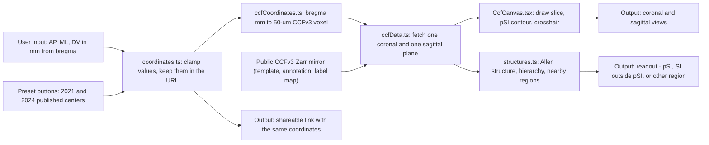
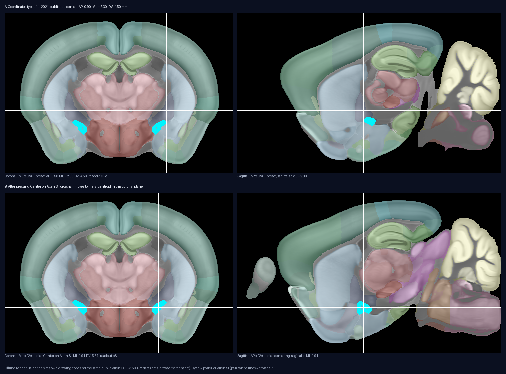
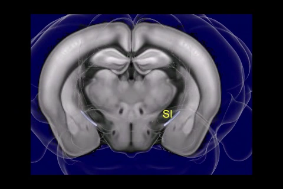
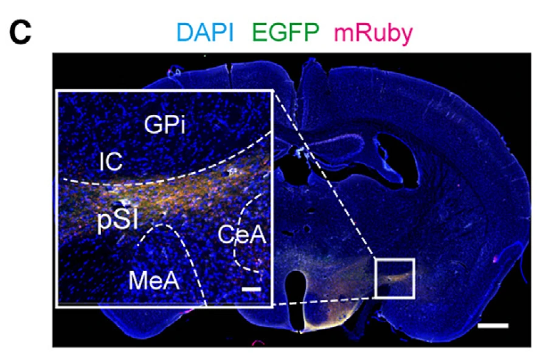
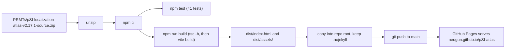

# pSI Localization Atlas

A web atlas for finding the posterior substantia innominata (pSI) in the mouse brain: type stereotaxic coordinates, see the matching Allen CCFv3 slices, and check what structure is under the crosshair.

**Live site:** https://neugun.github.io/pSI-atlas/ (production build of **v2.17.1**)

> pSI is the posterior part of Allen substantia innominata (SI), corresponding to the region targeted and validated in our experiments (Allen SI id 342, AP −0.7 to −1.6 mm from bregma).

## What this is and what problem it solves

The **substantia innominata (SI)** is a thin region at the base of the mouse forebrain. Its posterior part, **pSI**, is the region studied in the 2021 and 2024 Neuron papers listed under [Primary sources](#primary-sources). pSI is small, has no sharp border of its own, and is wedged between the globus pallidus (GP), internal capsule, optic tract, amygdala (MeA, CeA/CeM) and lateral hypothalamus (LH). Hitting it with an injection needle, optical fiber or electrode, and then confirming the hit in tissue sections, is hard.

Two coordinate systems make it harder. Surgical coordinates in the papers are given in the **Franklin–Paxinos** stereotaxic convention (millimetres from *bregma*, a landmark on the skull). The standard digital mouse brain, the **Allen Mouse Common Coordinate Framework v3 (CCFv3)**, is a 3-D reference volume with every voxel labelled by brain structure. The two are not voxel-identical. This site puts them side by side: it converts a bregma-referenced coordinate into a CCFv3 voxel, shows the coronal and sagittal slices through that voxel with the posterior SI outlined, names the structure at the crosshair, and keeps the published surgical coordinates as separate presets. The other pages collect the histological landmarks, paper figures, gene-expression and firing data needed to confirm a pSI site.

The site is a targeting and histology aid. Final localization still has to be checked in tissue.

## How it works

The interactive part is the **CCFv3 Locator** page. The other five pages are static content (text, figures, curated tables) bundled with the site.



Key facts, all from the source in `PRMTs/pSI-localization-atlas-v2.17.1-source.zip`:

- **Data.** The Locator reads the 50 µm Allen CCFv3 average template and annotation volumes as Zarr arrays from the public mirror `https://thewtex.github.io/allen-ccf-itk-vtk-zarr` (`src/lib/ccfData.ts`). The stored shape is 228 × 160 × 264 voxels in ML × DV × AP order. Only the one coronal and one sagittal plane currently displayed are downloaded, then cached. Nothing is bundled for the CCF itself; without internet the Locator shows a "CCFv3 data could not be loaded" message with a Retry button and deliberately draws no substitute anatomy.
- **Label remapping.** The mirror stores compact labels, not Allen IDs. `label_to_allen_id.json` is loaded once and every annotation value is remapped before use (`remapAnnotationLabels` in `src/lib/ccfData.ts`). Names, acronyms and colours for 1,328 structures are bundled in `src/data/allenStructures.json`.
- **Coordinate conversion.** `src/lib/ccfCoordinates.ts` converts mm-from-bregma to voxel indices using a fixed bregma landmark inside the CCF volume (`CCF_BREGMA_UM`: ML 5739, AP 5400, DV 332 µm) and 50 µm voxels. Inputs are clamped to AP −3.0…+1.0, ML 0…5.6, DV −7.5…+0.3 mm (`viewerBounds` in `src/lib/coordinates.ts`).
- **pSI rule.** A voxel is called pSI when its Allen ID is 342 (SI) **and** its AP lies between −1.6 and −0.7 mm (`isPosteriorSi`). That set is drawn as a 2-pixel cyan contour with a light cyan fill (`src/components/CcfCanvas.tsx`); every other structure keeps a muted version of its Allen colour.
- **Readout.** For the crosshair voxel the site reports the exact Allen structure, its hierarchy path, and the distinct annotated regions within 10 voxels (0.5 mm) in the coronal plane (`collectNearbyStructures` in `src/lib/structures.ts`).
- **Presets.** The two published surgical centres (2021: AP −0.90, ML 2.30, DV −4.50; 2024: AP −0.90, ML 2.20, DV −4.50) are stored in `presets` in `src/lib/coordinates.ts`. They are Franklin–Paxinos references and are *not* treated as identical to CCFv3 positions.

## Example result



*What to see:* the Locator's two panels at the 2021 preset (row A) and after pressing **Center on Allen SI** (row B). Cyan marks posterior Allen SI (pSI); white lines are the crosshair. In row A the crosshair sits just lateral to the cyan region and the readout is GPe, not SI. This is the Franklin–Paxinos vs CCFv3 mismatch the site warns about. In row B the crosshair is on the SI centroid in that coronal plane (ML 1.91, DV −5.37 mm) and the readout is pSI. This image was rendered offline with the site's own drawing code and the same public 50 µm data (it is not a browser screenshot); the live page adds the colour-coded readout panel below the two slices.



*What to see:* the whole Allen SI volume (left) next to a coronal section, from the video on the **Anatomy & circuits** page. pSI is the posterior part of this volume.



*What to see:* an experimental coronal section (Zhu, Miao, et al. 2024, Figure 2C) with VMHvl terminals in pSI. The target field lies below GPi/internal capsule and above MeA, with CeA lateral, which is the landmark arrangement taught on the **Locating pSI** page.

The two `assets/` images are files of the deployed build; their hashed names change whenever the site is rebuilt.

## Step by step: how to use the site

The site is a single page with six tabs in the top navigation bar. Only the Locator state is stored in the URL; the other tabs are reached by clicking.

1. Open https://neugun.github.io/pSI-atlas/. The **CCFv3 Locator** tab opens by default, at the 2021 preset (`?ap=-0.90&ml=2.30&dv=-4.50&side=right`). Wait for "Loading Allen CCFv3 slices…" to finish.
2. **Set a position.** In the *Coordinates* panel type AP, ML and DV in mm (step 0.05, or use the − / + buttons), pick the hemisphere (*Left* / *Right*), or drag the *Posterior SI A–P series* slider (AP −1.6 to −0.7). Or press one of the *Published Paxinos centers* buttons (**2021**, **2024**). You can also click directly in the coronal panel (sets ML and DV) or the sagittal panel (sets AP and DV).
3. **Read the result.** Under the two slices the readout shows: *Exact Allen CCFv3 structure* (acronym, name, Allen ID), *CCFv3 crosshair* (mm from bregma and voxel indices), *Posterior SI interpretation* (pSI / SI outside the pSI interval / outside SI), *Allen hierarchy*, and *Nearby CCFv3 regions within 0.5 mm*.
4. **Snap to SI.** If the readout says the crosshair is outside SI (at the 2021 preset it reports GPe), press **Center on Allen SI**. The crosshair jumps to the centroid of the SI annotation on the chosen hemisphere at the current AP level.
5. **Change the view.** Use *Histology* / *Annotation* / *Overlay* to switch what is drawn, and the *Show posterior Allen SI* checkbox to hide or show the cyan pSI contour. The *Data source* line shows which CCF server the slices came from.
6. **Share.** Press **Copy view URL**. The link (`?ap=…&ml=…&dv=…&side=…`) reopens the same crosshair. Scroll down for *Representative pSI sections* (three histology images).
7. **Locating pSI** tab: an eight-step guide for identifying pSI under the microscope (bracket the AP series, look at tissue, find caudal GP and internal capsule, use the optic tract, check MeA / CeA / CeM / LH, check molecular context, use tracing, verify the footprint), a *Landmark stack* schematic, the four *Criteria used for localization*, and links to the HCN1 preprint and the AmgC/M–PAG eLife study.
8. **Anatomy & circuits** tab: 01 *Localization and targeting* (eight PAG-retrograde coronal sections from bregma −0.70 to −1.40 mm, a PDF of the series, and three figure cards), 02 *Input anatomy* (VMHvl terminal panels, human SI atlas sections, the SI volume video), 03 *Circuit maps* (brain-wide inputs and outputs of pSI–PAG neurons). Click a card to open it full size.
9. **Gene expression & spatial profile** tab: method summary, spatial map and cell-type composition of pSI vs its five nearest neighbours (CEAl, CEAm, GPe, GPi, MEA) and anterior SI, and differential-expression figures and tables at the MERFISH-panel and scRNA-seq levels. Figures and tables are precomputed; the page does not run any analysis.
10. **Neural firing (Neuropixels)** tab: prior tetrode recordings (2021), where the IBL Brain-Wide Map units sit, method, pSI event-aligned firing, pSI vs each neighbour, significance and response subtypes, single-unit validation, and a response-manifold analysis. Also precomputed.
11. **References & other species** tab: the Franklin–Paxinos coordinates used in the papers with the targeting schematic and histology, Blue Brain Cell Atlas SI statistics, CCFv3 and other-species atlas links, and the four primary papers.

## Inputs and outputs

| Item | Format / location | Contents | Used or produced by |
| --- | --- | --- | --- |
| Coordinates | Typed values, URL query `ap`, `ml`, `dv`, `side` | AP, ML, DV in mm from bregma; hemisphere | Locator input (`src/lib/coordinates.ts`) |
| Clicks on the slices | Mouse click on the coronal or sagittal canvas | Sets ML/DV or AP/DV from the clicked voxel | Locator input (`src/components/Locator.tsx`) |
| CCFv3 template plane | Zarr uint16, fetched per view from `average_template_50_chunked.zarr` | 50 µm average-brain grey values | `src/lib/ccfData.ts` |
| CCFv3 annotation plane | Zarr uint16 from `allen_ccfv3_annotation_50_contiguous.zarr`, remapped with `label_to_allen_id.json` | Allen structure ID per voxel | `src/lib/ccfData.ts` |
| Structure table | `src/data/allenStructures.json` (bundled) | 1,328 records: id, name, acronym, colour | `src/lib/structures.ts` |
| Figures | `src/assets/**` (webp, png, pdf, mp4), copied into `assets/` at build | Paper panels, microscopy, analysis plots | All content pages |
| Curated tables | `src/data/experimentalImages.ts`, `src/data/geneExpression.ts`, `src/data/neuralActivity.ts` | Figure provenance; DE genes and cell counts; unit counts and statistics | Anatomy, Gene expression, Neural pages |
| Rendered slices | Two `<canvas>` elements in the browser | Overlay of template, annotation colours, pSI contour, crosshair | Output of `CcfCanvas.tsx` |
| Readout | Text panel in the browser | Structure at crosshair, hierarchy, nearby regions, mm and voxel values | Output of `Locator.tsx` |
| Share link | URL in the clipboard | Same view for another person | Output of **Copy view URL** |

The site writes no files. The only downloads a user can trigger are the bundled PDF, PNG and MP4 assets.

## Rebuilding from source



This repository holds the *built* site. The editable source is archived as a zip. The zip contains `package.json`, `package-lock.json`, `index.html`, `src/`, `scripts/`, `docs/`, `vite.config.ts`, `vite.single.config.ts` and the `tsconfig*.json` files (no `node_modules/`, no `dist/`).

```bash
unzip PRMTs/pSI-localization-atlas-v2.17.1-source.zip
cd pSI-localization-atlas-v2.17.1-source
npm ci                     # installs from package-lock.json
npm test                   # vitest run: 9 files, 41 tests
npm run typecheck          # tsc -b --pretty false
npm run build              # tsc -b && vite build  -> dist/
npm run dev -- --host 127.0.0.1   # local dev server (vite)
npm run preview            # serve dist/ locally (vite preview)
```

These are the exact `scripts` names in `package.json`. On 2026-09-21 this sequence was run with Node 24.18 and npm 12.0: all 41 tests passed and `npm run build` produced `dist/assets/index-Tha17llT.js` and `dist/assets/index-DCTtA-JQ.css`, the same hashed names as the deployed root build. The source does not declare a minimum Node version.

`vite.config.ts` sets `base: './'`, so the build works at the root of a GitHub Pages project site or in any subfolder.

**Self-hosted CCF data (optional).** By default the Locator reads from the public mirror. To serve the data yourself, download the official Allen files `average_template_50.nrrd` and `annotation_50.nrrd`, then run `python scripts/prepare_ccf_assets.py --template average_template_50.nrrd --annotation annotation_50.nrrd --output public/ccf` (needs `pynrrd`, `zarr<3`, `numcodecs`, `numpy`), and build with `VITE_CCF_BASE_URL=./ccf npm run build`. Details are in `docs/DATA_SOURCES.md` inside the zip.

**Single-file build (optional).** `npx vite build --config vite.single.config.ts` writes an inlined build to `dist-standalone/`; `node scripts/make-standalone.mjs` then merges it into one HTML file. Note that the output path is hard-coded to `/mnt/data/pSI-localization-atlas-v2.14-standalone.html` at `scripts/make-standalone.mjs:6`; change it before running on Windows. The standalone file still needs network access for the CCFv3 slices unless a local CCF root was configured.

## Deploying to GitHub Pages

GitHub Pages serves the **root of the `main` branch** (`.nojekyll` is present, so files are served as-is). To publish a new build:

1. Run `npm run build` in the unzipped source tree.
2. Replace `index.html` and the `assets/` directory at the root of this repository with the contents of `dist/`. Keep `.nojekyll`.
3. Add the new source snapshot as `PRMTs/pSI-localization-atlas-vX.Y.Z-source.zip` and update the version table below.
4. Commit and push to `main`; Pages redeploys within a few minutes.

## Adapting to another brain region or other uses

The Locator is generic CCFv3 code plus a handful of pSI-specific constants. To retarget it:

| What to change | Where (in the unzipped source) |
| --- | --- |
| Target structure ID (Allen ID 342 = SI) | `SI_STRUCTURE_ID` at `src/lib/ccfCoordinates.ts:4`; the same ID is also hard-coded three times in `pixelIsPosteriorSi`, `src/components/CcfCanvas.tsx:50-57` |
| AP interval that defines the sub-region (−1.6 to −0.7 mm) | `PSI_AP_RANGE` at `src/lib/ccfCoordinates.ts:5`; the slider limits `min="-1.6" max="-0.7"` at `src/components/Locator.tsx:170` |
| Display name and acronym shown when inside the interval | `resolveDisplayStructure` at `src/lib/ccfCoordinates.ts:49` |
| Published surgical presets and their button labels | `presets` at `src/lib/coordinates.ts:18-20`; button text and the Franklin–Paxinos note at `src/components/Locator.tsx:163-173` |
| Viewer coordinate limits | `viewerBounds` at `src/lib/coordinates.ts:10` |
| Bregma landmark inside the CCF volume | `CCF_BREGMA_UM` at `src/lib/ccfCoordinates.ts:3` (only if you use a different bregma convention) |
| Hierarchy paths shown for the target and its neighbours | `hierarchyPaths` at `src/lib/structures.ts:26` |
| Page titles and navigation labels | `src/App.tsx:13-18` (nav), `src/components/Locator.tsx:151` (heading) |
| Figures, captions and provenance | `src/assets/**` and `src/data/experimentalImages.ts`; content pages `src/components/IdentificationGuide.tsx`, `ExperimentalImages.tsx`, `GeneExpression.tsx`, `NeuralActivity.tsx`, `Resources.tsx` |
| CCF data server | `REMOTE_ROOT` at `src/lib/ccfData.ts:25`, or the `VITE_CCF_BASE_URL` build variable |

The tests in `src/__tests__/` assert pSI-specific text and IDs (for example `ccfCoordinates.test.ts` checks that SI voxels inside the interval are labelled pSI), so update them with the constants.

Assumptions built into the code: mouse brain, Allen CCFv3 at 50 µm, the mirror's ML × DV × AP array order, and the bregma landmark above. The 25 or 10 µm CCF volumes would need new `CCF_SHAPE`, `CCF_RESOLUTION_MM` and data URLs.

Other uses of the same parts:

- A locator for any other small Allen structure (change the ID and interval; drop the interval logic if the whole structure is the target).
- A teaching page that shows which Allen structure a stereotaxic coordinate lands in and lists the neighbours within 0.5 mm.
- A lightweight CCFv3 slice viewer: `src/lib/ccfData.ts` plus `src/components/CcfCanvas.tsx` fetch and draw single planes without loading the full volume.
- Turning bregma coordinates into CCFv3 voxel indices in other tools, using `stereotaxicToVoxel` / `voxelToStereotaxic` from `src/lib/ccfCoordinates.ts`.

## Repository layout

| Path | What it is |
| --- | --- |
| `index.html`, `assets/` | Production build (Vite output) of the current release, **v2.17.1**. This is what https://neugun.github.io/pSI-atlas/ serves. |
| `.nojekyll` | Tells GitHub Pages to serve the files as-is (no Jekyll processing). |
| `docs/img/` | Images used by this README (offline render of the Locator view). Not part of the site. |
| `PRMTs/pSI-localization-atlas-v2.17.1-source.zip` | **Current editable source** (React + TypeScript + Vite). Use this to rebuild or extend the site. |
| `PRMTs/pSI-localization-atlas-v2.14-source.zip` … `v2.17-source.zip` | Older source snapshots, kept for reference only. |
| `PRMTs/pSI-localization-atlas-v2.14-production.zip` | Older production build (v2.14), kept for reference only. |
| `PRMTs/index.html`, `PRMTs/assets/` | An earlier build of the site (before the gene-expression and neural-firing pages were added). Superseded by the root build but still served at https://neugun.github.io/pSI-atlas/PRMTs/. |
| `PRMTs/README.md` | Describes the archive folder. |
| `pSI_Localization_Atlas_Rebuild_Specification.docx` | Specification and reusable prompts describing the scientific requirements, page structure, and validation checks used to build the site. |

Inside the source zip: `src/components/` (one file per page plus `CcfCanvas.tsx`), `src/lib/` (coordinates, CCF data access, structure lookup), `src/data/` (structure table and curated content), `src/assets/` (figures), `src/__tests__/` (vitest), `scripts/` (`prepare_ccf_assets.py`, `make-standalone.mjs`), `docs/DATA_SOURCES.md` (data contract and deployment notes), `docs/superpowers/` (design plans and specs).

### Version history

| Version | Change |
| --- | --- |
| v2.17.1 (current) | Reordered neural page, expanded tetrode context, fixed undersized figures, rewrote README |
| v2.17 | Manifold analysis, probe-location diagram, tetrode context, navigation renames |
| v2.16 | Neural firing (Neuropixels) page; refreshed gene-expression page |
| v2.15 | Gene expression & spatial profile page |
| v2.14 | Baseline of the archived source/production zips |

## Dependencies

`package.json` (name `psi-localization-atlas`, version 2.17.1) pins most packages to `latest`; the versions below are what `package-lock.json` resolved to on 2026-09-21.

| Package | Version | Role |
| --- | --- | --- |
| react, react-dom | 19.2.7 | UI |
| vite, @vitejs/plugin-react | 8.1.4, 6.0.3 | Build and dev server |
| typescript | 7.0.2 | Type checking (`tsc -b`) |
| zarrita | 0.7.3 | Reads the CCFv3 Zarr arrays over HTTP |
| numcodecs | 0.3.2 | Decompresses Zarr chunks (blosc / zstd / lz4) |
| lucide-react | 1.24.0 | Icons |
| vitest, jsdom, @testing-library/react | 4.1.10, 29.1.1, 16.3.2 | Tests |

Runtime data dependency: the public CCFv3 Zarr mirror `https://thewtex.github.io/allen-ccf-itk-vtk-zarr` (or a self-hosted copy made with `scripts/prepare_ccf_assets.py`).

## Primary sources

- Zhu, Z., Ma, Q., Miao, L., Yang, H., et al. (2021). A Substantia Innominata–midbrain Circuit Controls a General Aggressive Response. *Neuron*. DOI: [10.1016/j.neuron.2021.03.002](https://doi.org/10.1016/j.neuron.2021.03.002)
- Zhu, Z., Miao, L., et al. (2024). A hypothalamic–amygdala circuit underlying sexually dimorphic aggression. *Neuron*. DOI: [10.1016/j.neuron.2024.06.022](https://doi.org/10.1016/j.neuron.2024.06.022)
- Li, K., Zhu, Z., et al. (2024). HCN1 channels in GABAergic amygdalar neurons underpin male-biased aggressive behaviors. *bioRxiv*. DOI: [10.1101/2024.12.07.627305](https://www.biorxiv.org/content/10.1101/2024.12.07.627305v1)
- Michael, V., et al. (2020). Circuit and synaptic organization of forebrain-to-midbrain pathways that promote and suppress vocalization. *eLife* 63493. https://elifesciences.org/articles/63493 — AmgC/M–PAG projection-defined targeting and its anatomical overlap with pSI

Figure panels on the site are reproduced from these papers and from the authors' own microscopy. Gene-expression and neural-firing pages summarise separate analyses (MERFISH + Allen Brain Cell Atlas scRNA-seq; IBL Brain-Wide Map Neuropixels) whose pipelines are not published in this repository.

## Status

Maintained as a companion to the papers above. The root build and `PRMTs/pSI-localization-atlas-v2.17.1-source.zip` are the current version; the `PRMTs/` build and older zips are archives.

## License

No license has been specified for this repository yet. Until one is added, the code and site content are "all rights reserved" by default; figure panels reproduced from the primary sources remain subject to their publishers' terms.
